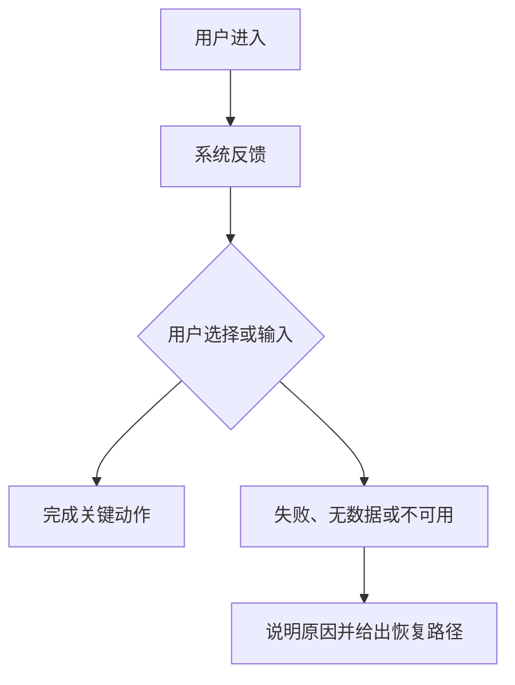

# [页面 / 功能名] Design Spec

## 定位与范围

- 任务名称：
- 产品形态 / 运行容器：
- 主端与适配策略：
- 目标用户与使用场景：
- 产品职责 / 决策任务：
- 本次范围：
- 明确不做：
- 业务目标与成功信号：
- 信息来源、证据与当前假设：

## 信息架构与布局

- 入口 / 初始状态：
- 信息主次、分组与阅读顺序：
- 核心区域与辅助区域：
- 空间关系与滚动归属：
- 端侧 / 断点重排：
- 最终行动：

| 页面 / 状态 | 主要任务 | 允许出现 | 不允许出现 | 进入方式 | 返回 / 去向 |
| ----------- | -------- | -------- | ---------- | -------- | ----------- |
|             |          |          |            |          |             |

## 核心链路

将节点替换为本次任务的具体动作、反馈和分支，不保留通用占位文字。

## 组件与实现映射

### [组件 / 区域名]

- 作用与内容来源：
- 组件选型 / 复用来源：
- 布局与间距档位：
- 语义 token：
- 默认状态：
- 交互与状态变化：
- 所属页面 / 状态：

## 边界条件

- 空状态：
- 加载状态：
- 错误状态：
- 权限 / 不可用状态：
- 风险与恢复路径：

## 验收清单

每条写成“页面 / 状态 + 操作或条件 + 可观察结果”，不要照抄通用句。

- [ ] [页面 / 状态] 在 [操作或条件] 下，[可观察结果]。
- [ ] 每个组件均有复用来源；无匹配项已标记“待设计师确认”。
- [ ] 布局、滚动和端侧重排可逐项验证。
- [ ] 组件、间距和颜色只使用当前项目与 brand 已有约束。
